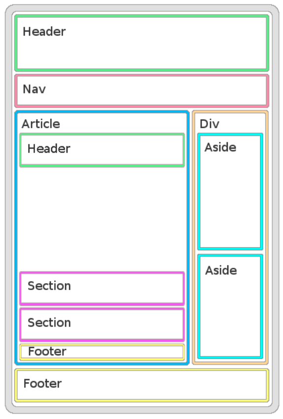

# Estructuras básicas de HTML

Edita el fichero `index.html` para que tenga un HTML correspondiente a la imagen siguiente:

El HTML resultante debe ser validado por el [validador de HTML de la W3](https://validator.w3.org/#validate_by_input) y no dar ningún error.
